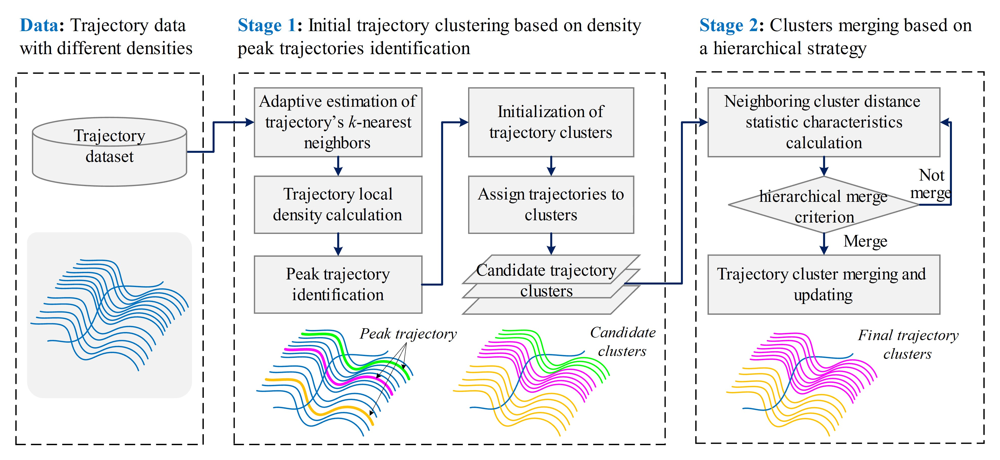








# 关于我

我本科/博士毕业于湖南长沙的 中南大学 地球科学与信息物理学院，我的导师是邓敏教授。我已经发表 10+ 篇学术论文
 。
 
 📥 下载我的[[简历]](/pengju-x/pdf/myCVs/0730-En-CV- Ju Peng.pdf)

我的研究领域包括：
- 时空数据挖掘
- 轨迹聚类
- 人类移动性
- 流行病
- 健康地理

# 🎓 学历
- *2021.09 - 2026.06*,  中南大学 地球科学与信息物理学院, 湖南长沙, 推免直博 
- *2017.09 - 2021.06*,  中南大学 地球科学与信息物理学院, 湖南长沙, 本科
 

# 🔥 新闻

- 2025.09.03: 🎉Congratulations! One paper was accepted by JGSA 2025!

# 📝 论文专利

### 英文

Sens. Actuators Phys. 2021

- `Ju Peng`, Jianbo Tang*, Min Deng, et al. A two-stage method for detecting trajectory clusters of different densities with peak trajectories identification[J]. *International Journal of Geographical Information Science*, 2025: 1-34. (SCI, JCR Q1, 中科院1区TOP, IF=5.1)
[[网页]](https://doi.org/10.1080/13658816.2025.2478463)[[预览]](https://github.com/pengju-x/pengju-x/blob/master/pdf/2025/2025_IJGIS_A_two-stage_method_for_detecting_trajectory_clusters_of_different_densities_with_peak_trajectories_identification.pdf) [[下载]](/pengju-x/pdf/2025/2025_IJGIS_A_two-stage_method_for_detecting_trajectory_clusters_of_different_densities_with_peak_trajectories_identification.pdf)

- `Ju Peng`, Jianbo Tang*, Min Deng, et al. A two-stage method for detecting trajectory clusters of different densities with peak trajectories identification[J]. *International Journal of Geographical Information Science*, 2025: 1-34. (SCI, JCR Q1, 中科院1区TOP, IF=5.1)
[[网页]](https://doi.org/10.1080/13658816.2025.2478463)[[预览]](https://github.com/pengju-x/pengju-x/blob/master/pdf/2025/2025_IJGIS_A_two-stage_method_for_detecting_trajectory_clusters_of_different_densities_with_peak_trajectories_identification.pdf) [[下载]](/pengju-x/pdf/2025/2025_IJGIS_A_two-stage_method_for_detecting_trajectory_clusters_of_different_densities_with_peak_trajectories_identification.pdf)

- `Ju Peng`, Min Deng, Jianbo Tang*, et al. A movement-aware measure for trajectory similarity and its application for ride-sharing path extraction in a road network[J]. *International Journal of Geographical Information Science*, 2024, 38(9): 1703-1727. (SCI, JCR Q1, 中科院1区TOP, IF=5.1)[[网页]](https://doi.org/10.1080/13658816.2024.235369)
[[预览]](https://github.com/pengju-x/pengju-x/blob/master/pdf/2024/2024_IJGIS_A_movement-aware_measure_for_trajectory_similarity_and_its_application_for_ride-sharing_path_extraction_in_a_road_network.pdf) [[下载]](/pengju-x/pdf/2024/2024_IJGIS_A_movement-aware_measure_for_trajectory_similarity_and_its_application_for_ride-sharing_path_extraction_in_a_road_network.pdf)

- Jianbo Tang, Min Deng, `Ju Peng*`, et al. How to describe spatiotemporal patterns of moving objects: A new classification framework[J]. *International Journal of Geographical Information Science*, 2025: 1-43.  (SCI, JCR Q1, 中科院1区TOP, IF=5.1)[[网页]](https://doi.org/10.1080/13658816.2025.2548819)
[[预览]](https://github.com/pengju-x/pengju-x/blob/master/pdf/2025/2025_IJGIS_How_to_describe_spatiotemporal_patterns_of_moving_objects_a_new_classification_framework.pdf) [[下载]](/pengju-x/pdf/2025/2025_IJGIS_How_to_describe_spatiotemporal_patterns_of_moving_objects_a_new_classification_framework.pdf)

- Jianbo Tang, Min Deng, `Ju Peng`, et al. Automatic road network selection method considering functional semantic features of roads with graph convolutional networks[J]. *International Journal of Geographical Information Science*, 2024, 38(11): 2403-2432. (SCI, JCR Q1, 中科院1区TOP, IF=5.1)
[[网页]](https://doi.org/10.1080/13658816.2024.238719)[[预览]](https://github.com/pengju-x/pengju-x/blob/master/pdf/2024/2024_IJGIS_Automatic_road_network_selection_method_considering_functional_semantic_features_of_roads_with_graph_convolutional_networks.pdf) [[下载]](/pengju-x/pdf/2024/2024_IJGIS_Automatic_road_network_selection_method_considering_functional_semantic_features_of_roads_with_graph_convolutional_networks.pdf)

- Min Deng (导师一作), `Ju Peng`, Jianbo Tang*, et al. Spatio-temporal Pattern Mining of Moving Objects: Concepts, Methods, and Challenges[J]. *Journal of Geovisualization and Spatial Analysis*, 2025, 9(2): 1-32. (ESCI, JCR Q1, 中科院1区TOP, IF=6.8)
[[网页]](https://doi.org/10.1007/s41651-025-00236-1)
[[预览]](https://github.com/pengju-x/pengju-x/blob/master/pdf/2025/2025_JGSA_Spatiotemporal_Pattern_Mining_of_Moving_Objects_Concepts_Methods_and_Challenges.pdf) [[下载]](/pengju-x/pdf/2025/2025_JGSA_Spatiotemporal_Pattern_Mining_of_Moving_Objects_Concepts_Methods_and_Challenges.pdf)

- `Ju Peng`, Jianbo Tang*, Min Deng, et al. Discovering spatiotemporal patterns of human outdoor activities with crowdsourced trajectory data[J]. *Geo-spatial Information Science*, 2025, 28(3): 1214-1236. (SCI, JCR Q1, 中科院1区, IF=5.5)
[[网页]](https://doi.org/10.1080/10095020.2025.2506772)[[预览]](https://github.com/pengju-x/pengju-x/blob/master/pdf/2025/2025_GSIS_Discovering_spatiotemporal_patterns_of_human_outdoor_activities_with_crowdsourced_trajectory_data.pdf) [[下载]](/pengju-x/pdf/2025/2025_GSIS_Discovering_spatiotemporal_patterns_of_human_outdoor_activities_with_crowdsourced_trajectory_data.pdf)

- `Ju Peng`, Huimin Liu, Jianbo Tang*, et al. Exploring crowd travel demands based on the characteristics of spatiotemporal interaction between urban functional zones[J]. *ISPRS International Journal of Geo-Information*, 2023, 12(6): 225. (SCI, JCR Q2, 中科院3区, IF=2.8)
[[网页]](https://doi.org/10.3390/ijgi12060225)[[预览]](https://github.com/pengju-x/pengju-x/blob/master/pdf/2023/2023_IJGI_Exploring_Crowd_Travel_Demands_Based_on_the_Characteristic.pdf) [[下载]](/pengju-x/pdf/2023/2023_IJGI_Exploring_Crowd_Travel_Demands_Based_on_the_Characteristic.pdf)

- Jianbo Tang, Yuxin Zhao, Xuexi Yang*, Min Deng, Huimin Liu, Chen Ding, `Ju Peng`, Xiaoming Mei. Statistical and density-based clustering of geographical flows for crowd movement patterns recognition[J]. *Applied Soft Computing*, 2024, 163: 111912.  (SCI, JCR Q1, 中科院2区TOP, IF=6.6)
[[网页]](https://doi.org/10.1016/j.asoc.2024.111912)
[[预览]](https://github.com/pengju-x/pengju-x/blob/master/pdf/2024/2024_ASOC_Statistical_and_density-based_clustering_of_geographical_flows_for_crowd_movement_patterns_recognition.pdf) [[下载]](/pengju-x/pdf/2024/2024_ASOC_Statistical_and_density-based_clustering_of_geographical_flows_for_crowd_movement_patterns_recognition.pdf)

- Jingyi Liu, Zhiyuan Hu*, Jianbo Tang, `Ju Peng`, Qi Guo, Xinyu Pei. STACS: a spatiotemporal adaptive clustering–segmentation algorithm for fishing activity recognition[J]. *Applied Science*, 2025, 15(16): 9107. (SCI, JCR Q2, IF=2.5)
[[网页]](https://doi.org/10.3390/app15169107)[[预览]](https://github.com/pengju-x/pengju-x/blob/master/pdf/2025/2025_AppliedSciences_STACS_a_spatiotemporal_adaptive_clustering_segmentation_algorithm_for_fishing_activity_recognition.pdf) [[下载]](/pengju-x/pdf/2025/2025_AppliedSciences_STACS_a_spatiotemporal_adaptive_clustering_segmentation_algorithm_for_fishing_activity_recognition.pdf)

### 中文

- 唐建波, 胡致远, `彭举*`, 等. 融合视觉特征与运动特征的众源轨迹数据道路交叉口识别方法[J]. *测绘学报*, 2025, 54(01): 1001-1595. (EI, 地理学会T1期刊)
[[网页]](http://dx.doi.org//10.11947/j.AGCS.2025.20240101)
[[预览]](https://github.com/pengju-x/pengju-x/blob/master/pdf/2025/2025_测绘学报_融合视觉特征与运动特征的众源轨迹数据道路交叉口识别方法.pdf) [[下载]](/pengju-x/pdf/2025/2025_测绘学报_融合视觉特征与运动特征的众源轨迹数据道路交叉口识别方法.pdf)

- 刘敬一, `彭举*`, 唐建波, 等. 融合多特征的轨迹数据自适应聚类方法[J]. *地球信息科学学报*, 2023, 25(07): 1363-1377. (EI, 地理学会T2期刊)
[[网页]](http://dx.doi.org//10.12082/dqxxkx.2023.230066)
[[预览]](https://github.com/pengju-x/pengju-x/blob/master/pdf/2023/2023_地球信息科学学报_融合多特征的轨迹数据自适应聚类方法.pdf) [[下载]](/pengju-x/pdf/2023/2023_地球信息科学学报_融合多特征的轨迹数据自适应聚类方法.pdf)

- 唐建波*, 夏何炎, `彭举`, 等. 融合众源轨迹数据的户外徒步旅行导航路网地图构建[J]. *地球信息科学学报*, 2025, 27(01): 151-166.  (EI, 地理学会T2期刊)
[[网页]](http://dx.doi.org/10.12082/dqxxkx.2025.240479)
[[预览]](https://github.com/pengju-x/pengju-x/blob/master/pdf/2025/2025_地球信息科学学报_融合众源轨迹数据的户外徒步旅行导航路网地图构建.pdf) [[下载]](/pengju-x/pdf/2025/2025_地球信息科学学报_融合众源轨迹数据的户外徒步旅行导航路网地图构建.pdf)

- 彭程, 唐建波, `彭举`, 等. 基于自适应轨迹聚类的城市路网提取与更新方法[J]. *时空信息学报*, 2023, 30(02): 209-217. 
[[网页]](https://doi.org/10.20117/j.jsti.202302007)
[[预览]](https://github.com/pengju-x/pengju-x/blob/master/pdf/2023/2023_时空信息学报_基于自适应轨迹聚类的城市路网提取与更新方法.pdf) [[下载]](/pengju-x/pdf/2023/2023_时空信息学报_基于自适应轨迹聚类的城市路网提取与更新方法.pdf)

- 唐建波, 丁俊杰, 张天宇, 杨晨, `彭举`. 基于行人轨迹数据的步行导航路网地图构建方法[J]. *时空信息学报*, 2026, 33(2): 184-196.
[[网页]](https://doi.org/10.20117/j.jsti.202602005)
[[预览]](https://github.com/pengju-x/pengju-x/blob/master/pdf/2026/2026_时空信息学报_基于行人轨迹数据的步行导航路网地图构建方法.pdf) [[下载]](/pengju-x/pdf/2026/2026_时空信息学报_基于行人轨迹数据的步行导航路网地图构建方法.pdf)  

### 专利

- `彭举`, 唐建波, 胡致远, 等. 一种基于移动目标轨迹的运动模式挖掘方法及相关设备[P]. 中国专利: ZL20251 0216690.2 [P].2025-05-16. (已授权) 
- `彭举`, 唐建波, 胡致远, 等. 一种基于峰值轨迹的轨迹聚类方法、装置、设备及介质[P]. 中国专利: ZL202311636437.X. [P]. 2024-03-19. (已授权)
- 唐建波, `彭举`, 邓敏, 等. 多源数据协同的人车路网一体化构建方法[P]. 中国专利: ZL202210909277.0. [P]. 2024-07-30. (已授权)
- 唐建波, `彭举`, 胡致远, 等. 融合众源轨迹数据的户外三维步行导航路网地图生成方法[P]. 中国专利: ZL202311461668.1. [P]. 2024-03-19. (已授权)

# 🏅 荣誉奖项
- *2026* 获得 中南大学`优秀毕业生`
- *2025* 获得 中南大学`校长奖学金创新奖`
- *2025* 获得 第十三届高校GIS论坛 `GIS新秀`
- *2024* 获得 第十一届全国地理信息科学博士生学术论坛`优秀报告奖`
- *2024* 获得 中南大学`校长奖学金创新奖`
- *2024* 获得 中南大学`优秀学生`
- *2022* 获得 华为软件精英挑战赛（武长赛区）`三等奖` 
- *2021* 获得第十八届中国研究生数学建模竞赛`二等奖`

# 🏛️ 学术会议
-	*2025.11.07-09* 第十三届GIS高校论坛（中国·上海，），口头汇报
-	*2025.09.19-21* 第十一届全国地图学与地理信息系统学术大会（中国·南京），口头汇报
-	*2024.11.29-12.01* 第十一届地理信息科学博士生论坛（中国·南京），口头汇报
-	*2024.10.19-20* 第十九届地理信息科学理论与方法学术年会（中国·西安，），口头汇报
-	*2024.04.16-20* 美国国家地理学学会年会（美国·夏威夷，），口头汇报
-	*2024.11.15-17* 第七届地图制图学理论与方法研讨会（中国·长沙，），参会
-	*2023* 第十八届地理信息科学理论与方法学术年会（中国·桂林，），参会
-	*2021.10.29-31* 第九届GIS高校论坛（中国·长沙），参会
-	*2021.05.18-19* 第十届全球地理信息开发者大会（中国·长沙，），参会

# 📚 科研项目
-	*湖南省研究生科研创新项目*：多源轨迹大数据支持下的移动目标运动模式-行为语义体系构建与智能识别，项目编号：CX20220193，2022-2024，结题，主持。负责项目申请、研究方案设计与整体实施、结题验收以及成果整理与学术论文发表。
-	*中南大学研究生自主探索创新项目*：多源轨迹大数据支持下的移动目标运动模式-行为语义体系构建与智能识别，项目编号：2022zzts105，2022-2024，结题，主持。负责项目申请、研究方案设计与整体实施、结题验收以及成果整理与学术论文发表。
